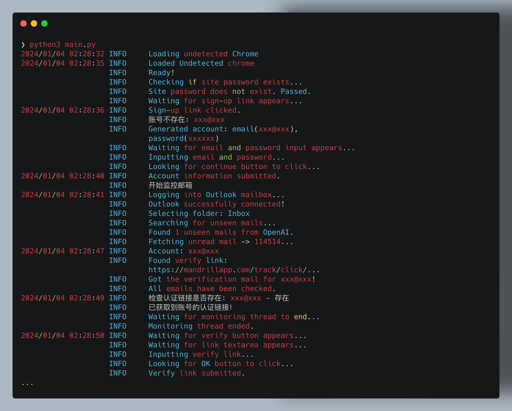
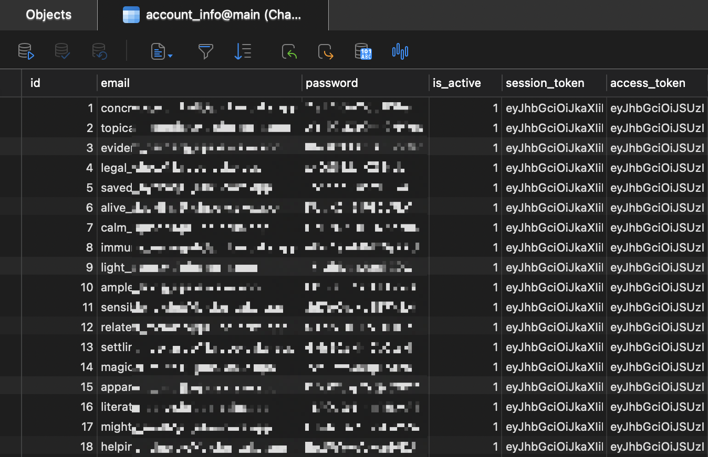

# ChatGPT-Register

<div align="center">
   
   🫷🥹🫸
   
</div>

<br/>

**ChatGPT-Register** 是一个自动化工具，**免代理**、**不封号**、**无限量**、**无人工干预**地注册 ChatGPT 账号。

结合[PandoraNext](https://docs.pandoranext.com/zh-CN)项目和[Capsolver](https://www.capsolver.com/zh)，它实现了一个高效的注册流程。

完全模拟整个注册流程，在安全无风险的基础上，单个实例注册用时仅需 2min！且多开情况下，每个实例互不影响。

## 特点

- 🚀 **自动化注册**：自动完成整个ChatGPT账号注册流程，使用`Capsolver`来绕过注册中的验证码。
- 🌐 **免代理**：不用代理池、注册再多也不被ban本机IP。（感谢`PandoraNext`项目的贡献）
- 📧 **邮箱监控**：自动监控和处理OpenAI的`Verification`认证邮件。
- 🐍 **Python脚本**：使用`Python`和`selenium`自动操作，并使用`undetected_chromedriver`防止检测。
- 🐳 **Docker支持**：通过`Docker Compose`轻松部署。
- 📦 **灵活数据存储**：结果保存在`SQLite`数据库，支持自定义存储。

## 安装指南

### 公共步骤：
1. 克隆仓库：
   ```bash
   git clone https://github.com/QvQQ/ChatGPT-Register
   cd ChatGPT-Register
   ```
2. 复制并编辑配置文件：
   ```bash
   cp config_template.yaml config.yaml
   # 编辑 config.yaml 文件
   ```

### 方法一：通过本机直接运行（推荐）
1. 安装依赖：
   ```bash
   pip install -r requirements.txt
   ```
2. 运行脚本：
   ```bash
   python main.py
   ```

### 方法二：使用Docker Compose
1. 在项目根目录下运行：
   ```bash
   docker compose up
   ```
    PS. 由于使用了 Selenium 来模拟请求，对主机配置有较高要求。如果报错，可以尝试延长程序中寻找元素的等待时间。

2. （可选）要查看容器内部的情况，请访问容器内置的 `noVNC` 服务
   http://localhost:7900/?autoconnect=1&resize=scale&password=secret

## 结果存储

注册的结果将被保存在SQLite数据库 `account.db` 中。您可以使用Navicat等软件查看数据库，或修改存储函数将结果存储至txt文件中。欢迎提出Pull Request共同改进项目。
- **Update 2024.1.5** 现在可以连接远程服务器的数据库了！

## 配置文件说明

`config_template.yaml` 文件中包含以下配置项：

```yaml
# 是否使用 headless 模式(Docker 与本地都可以关闭无头模式进行测试)
headless_browser: true

# 所有注册账号的邮箱后缀，包含`@`
account_postfix: ""

# Capsovler 的 client_key
client_key: ""

# PandoraNext 镜像站网址
pandora_next_website: "https://chat.oaifree.com"

# PandoraNext 镜像站的 site_password（如有）
site_password: ""

# IMAP 服务器设置（须支持SSL）
IMAP_server: "outlook.office365.com"
IMAP_port: 993

# 接收认证邮件的邮箱账号与密码
email_username: ""
email_password: ""

# 接收认证邮件的邮箱收件箱名称（如Outlook的"Inbox"）
email_folder: "Inbox"

# ChatGPT 使用的 FunCaptcha 类型（不定期会变化，可以在 capsolver 官网查看所有类型）
puzzle_type: "train_coordinates"
```

请根据您的需要编辑这些配置项。

## 使用示例

- 注册过程的日志截图：
  
  

- 数据库中的账号截图：
  
  

## 加入我们

欢迎加入微信群，获取更多信息和支持：


## 贡献

期待您的Pull Request和建议，一起完善这个项目。

## 许可

本项目采用 MIT 许可证。
